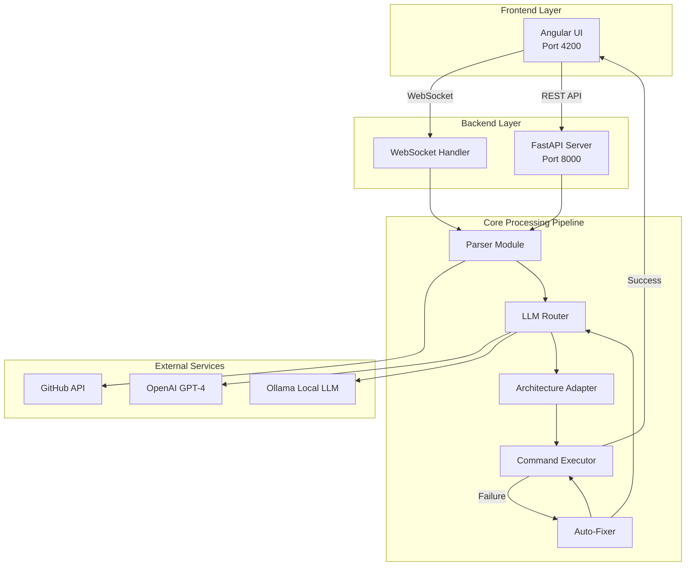
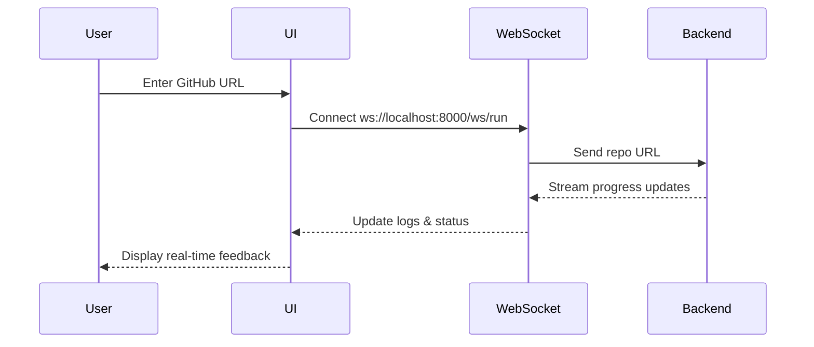
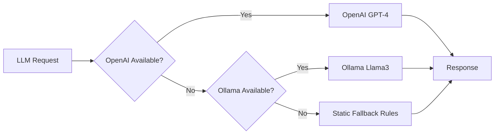
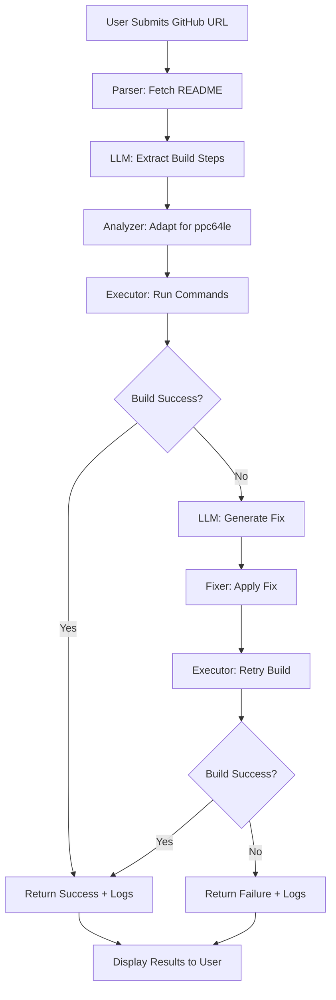
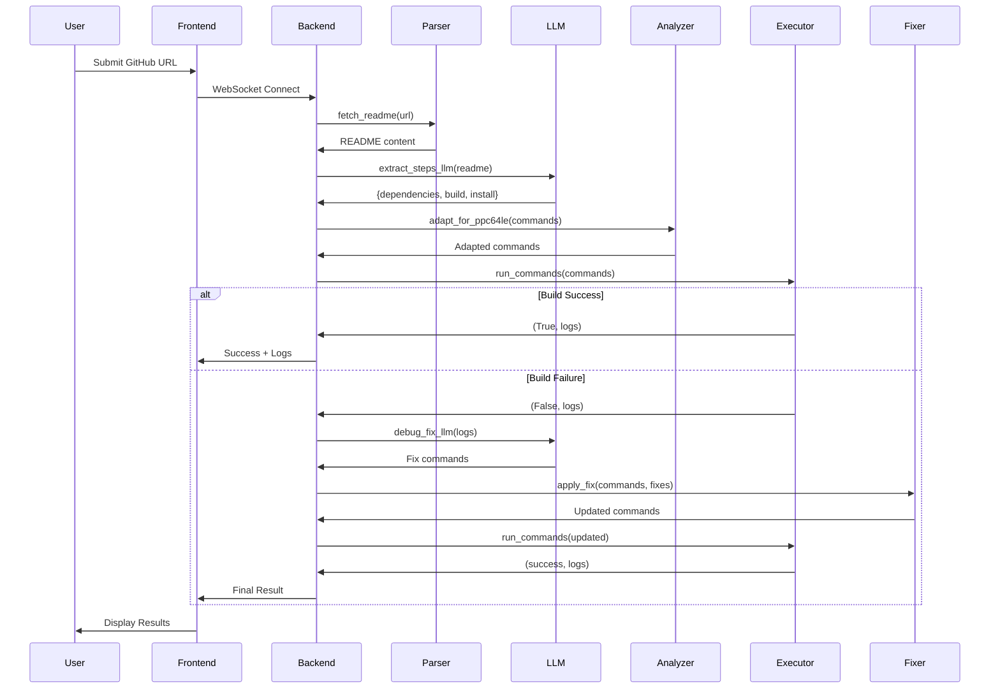
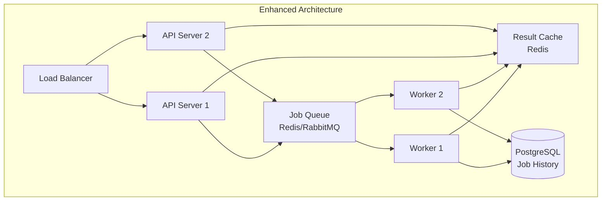
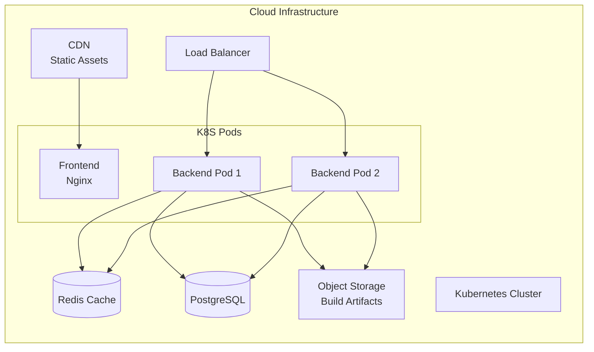
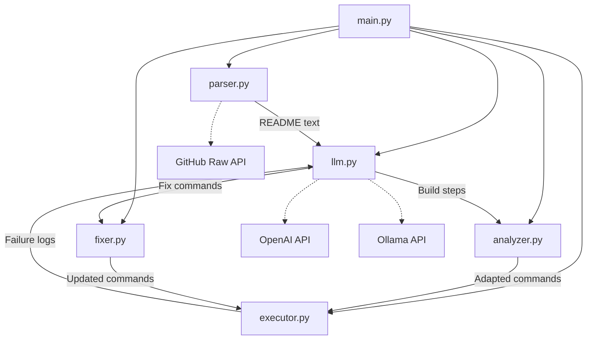

# PowerPort Architecture Plan

## 🎯 System Overview

**PowerPort** is an AI-powered platform that automatically ports open-source projects from x86/AMD64 architecture to IBM Power (ppc64le). It uses LLM intelligence to analyze, adapt, build, and self-heal build processes.

---

## 🏗️ High-Level Architecture



---

## 📦 Component Architecture

### 1. Frontend Layer (Angular 17)

**Technology Stack:**
- Angular 17 (Standalone Components)
- TypeScript 5.4
- RxJS for reactive programming
- WebSocket for real-time communication

**Key Components:**

#### [`app.component.ts`](frontend/src/app/app.component.ts:1)
- **Responsibility:** Main UI orchestrator
- **Features:**
  - Real-time log streaming via WebSocket
  - Pipeline stage visualization (Fetch → Analyze → Build → Fix → Validate)
  - Progress tracking
  - Command output display
  - AI reasoning visualization

**Communication Pattern:**


---

### 2. Backend Layer (FastAPI)

**Technology Stack:**
- FastAPI (async web framework)
- Uvicorn (ASGI server)
- Python 3.11+
- WebSocket support

**API Endpoints:**

#### REST API
- **POST** [`/port`](backend/app/main.py:27) - Synchronous porting operation
  - Input: `{"repo_url": "string"}`
  - Output: `{"success": bool, "commands": [], "logs": []}`

#### WebSocket API
- **WS** [`/ws/run`](backend/app/main.py:51) - Real-time streaming porting
  - Bidirectional communication
  - Live progress updates
  - Error streaming

---

### 3. Core Processing Modules

#### 3.1 Parser Module ([`parser.py`](backend/app/parser.py:1))

**Purpose:** Fetch and extract README content from GitHub repositories

**Function:** [`fetch_readme(repo_url)`](backend/app/parser.py:3)
- Converts GitHub URL to raw content URL
- Fetches README.md from main branch
- Returns raw text for LLM processing

**Example Flow:**
```
Input:  https://github.com/user/repo
Transform: https://raw.githubusercontent.com/user/repo/main/README.md
Output: README text content
```

---

#### 3.2 LLM Module ([`llm.py`](backend/app/llm.py:1))

**Purpose:** Intelligent LLM routing with fallback strategy

**Architecture:**


**Key Functions:**

1. [`call_llm(prompt)`](backend/app/llm.py:31) - Core router
   - Tries OpenAI first (if API key available)
   - Falls back to Ollama (local)
   - Final fallback to static rules
   - Returns: `{"provider": str, "latency": float, "content": str}`

2. [`extract_steps_llm(readme)`](backend/app/llm.py:119) - Build step extraction
   - Analyzes README content
   - Extracts dependencies, build steps, install steps
   - Returns structured JSON:
   ```json
   {
     "dependencies": ["pkg1", "pkg2"],
     "build": ["make", "cmake"],
     "install": ["make install"]
   }
   ```

3. [`debug_fix_llm(logs)`](backend/app/llm.py:152) - Auto-fix generation
   - Analyzes build failure logs
   - Generates corrective commands
   - Returns list of shell commands

**Resilience Features:**
- Timeout protection (20s)
- Retry mechanism (2 attempts)
- Safe JSON parsing with cleanup
- Graceful degradation

---

#### 3.3 Analyzer Module ([`analyzer.py`](backend/app/analyzer.py:1))

**Purpose:** Architecture-specific command adaptation

**Function:** [`adapt_for_ppc64le(commands)`](backend/app/analyzer.py:1)

**Transformation Rules:**
```python
x86_64 → ppc64le
amd64 → ppc64le
-march=native → -mcpu=power10
```

**Example:**
```bash
# Input
gcc -march=native -o app main.c

# Output
gcc -mcpu=power10 -o app main.c
```

---

#### 3.4 Executor Module ([`executor.py`](backend/app/executor.py:1))

**Purpose:** Sequential command execution with logging

**Function:** [`run_commands(commands)`](backend/app/executor.py:3)

**Behavior:**
- Executes commands sequentially using subprocess
- Captures stdout and stderr
- Stops on first failure
- Returns: `(success: bool, logs: List[Dict])`

**Log Structure:**
```python
{
  "cmd": "make",
  "output": "stdout + stderr combined"
}
```

---

#### 3.5 Fixer Module ([`fixer.py`](backend/app/fixer.py:1))

**Purpose:** Apply LLM-generated fixes

**Function:** [`apply_fix(commands, fixes)`](backend/app/fixer.py:1)

**Strategy:**
- Replaces entire command list with fixes
- Simple replacement strategy (can be enhanced)

---

## 🔄 Complete Processing Pipeline



---

## 🐳 Containerization Strategy

### Backend Container ([`Dockerfile.backend`](docker/Dockerfile.backend:1))
```dockerfile
Base: python:3.11
Port: 8000
Dependencies: FastAPI, Uvicorn, Requests, OpenAI
```

### PPC64LE Build Container ([`Dockerfile.ppc64le`](docker/Dockerfile.ppc64le:1))
```dockerfile
Base: Red Hat UBI9
Tools: gcc, make, cmake, python3
Purpose: Actual build execution environment
```

---

## 🔌 Integration Points

### 1. Frontend ↔ Backend
- **Protocol:** WebSocket (primary), REST (fallback)
- **Port:** 8000
- **CORS:** Enabled for all origins

### 2. Backend ↔ GitHub
- **Protocol:** HTTPS
- **Endpoint:** raw.githubusercontent.com
- **Authentication:** None (public repos)

### 3. Backend ↔ LLM Services
- **OpenAI:** REST API with API key
- **Ollama:** Local HTTP API (port 11434)
- **Fallback:** Static rules

---

## 📊 Data Flow



---

## 🎨 UI Architecture

### Layout Structure
```
┌─────────────────────────────────────────────┐
│  Header: PowerPort AI Platform              │
│  Status: [Running/Done/Idle]                │
├─────────────────────────────────────────────┤
│  Input: [GitHub URL] [Run Pipeline Button]  │
├─────────────────────────────────────────────┤
│  Pipeline: [Fetch][Analyze][Build][Fix][✓]  │
├─────────────────────────────────────────────┤
│  ┌──────────┬──────────┬──────────┐         │
│  │ Live Logs│ Commands │ AI Reason│         │
│  │          │          │          │         │
│  │ (2fr)    │ (1fr)    │ (1fr)    │         │
│  └──────────┴──────────┴──────────┘         │
├─────────────────────────────────────────────┤
│  Progress Bar: [████████░░] 80%             │
└─────────────────────────────────────────────┘
```

### State Management
- **Status:** idle → running → done
- **Progress:** 0% → 100% (5 stages × 20%)
- **Logs:** Real-time append with auto-scroll
- **Commands:** Accumulated during execution

---

## 🔒 Security Considerations

### Current Implementation
- ⚠️ CORS enabled for all origins (development mode)
- ⚠️ No authentication on endpoints
- ⚠️ Direct command execution (subprocess)
- ⚠️ No input sanitization

### Recommended Enhancements
1. Add authentication/authorization
2. Implement rate limiting
3. Sanitize GitHub URLs
4. Sandbox command execution
5. Restrict CORS to specific origins
6. Add request validation

---

## 📈 Scalability Considerations

### Current Limitations
- Single-threaded command execution
- No job queue
- No result caching
- Synchronous LLM calls

### Scaling Strategy


---

## 🧪 Testing Strategy

### Unit Tests Needed
- [`parser.py`](backend/app/parser.py:1): URL transformation, error handling
- [`analyzer.py`](backend/app/analyzer.py:1): Architecture adaptation rules
- [`llm.py`](backend/app/llm.py:1): Fallback logic, JSON parsing
- [`executor.py`](backend/app/executor.py:1): Command execution, log capture
- [`fixer.py`](backend/app/fixer.py:1): Fix application logic

### Integration Tests Needed
- End-to-end pipeline flow
- WebSocket communication
- LLM provider switching
- Error recovery loops

### E2E Tests Needed
- Complete porting workflow
- UI interaction scenarios
- Real GitHub repository processing

---

## 🚀 Deployment Architecture

### Development
```
Frontend: localhost:4200 (ng serve)
Backend: localhost:8000 (uvicorn)
Ollama: localhost:11434
```

### Production (Recommended)


---

## 📝 Technology Stack Summary

| Layer | Technology | Version | Purpose |
|-------|-----------|---------|---------|
| **Frontend** | Angular | 17.3 | UI Framework |
| | TypeScript | 5.4 | Type Safety |
| | RxJS | 7.8 | Reactive Programming |
| **Backend** | FastAPI | Latest | API Framework |
| | Python | 3.11+ | Runtime |
| | Uvicorn | Latest | ASGI Server |
| **AI/ML** | OpenAI | GPT-4 | Primary LLM |
| | Ollama | Llama3 | Local LLM Fallback |
| **Infrastructure** | Docker | Latest | Containerization |
| | Red Hat UBI9 | Latest | Build Environment |

---

## 🔮 Future Enhancements

Based on the README, planned features include:

1. **Podman Execution** - Container-based build isolation
2. **Benchmarking** - Performance comparison (x86 vs ppc64le)
3. **OpenShift Deployment** - Enterprise Kubernetes platform
4. **Multi-architecture Support** - ARM, RISC-V
5. **Build Caching** - Speed up repeated builds
6. **Parallel Execution** - Multiple projects simultaneously
7. **CI/CD Integration** - GitHub Actions, GitLab CI
8. **Metrics Dashboard** - Success rates, build times

---

## 📋 Module Dependency Graph



---

## 🎯 Key Design Patterns

### 1. **Strategy Pattern** (LLM Module)
- Multiple LLM providers with fallback
- Runtime selection based on availability

### 2. **Pipeline Pattern** (Main Flow)
- Sequential processing stages
- Each stage transforms data for next

### 3. **Retry Pattern** (Executor + Fixer)
- Automatic retry on failure
- AI-powered fix generation

### 4. **Observer Pattern** (WebSocket)
- Real-time event streaming
- Frontend observes backend state changes

---

## 📊 Performance Characteristics

### Current Metrics
- **README Fetch:** ~1-2s (network dependent)
- **LLM Extraction:** 5-20s (model dependent)
- **Command Adaptation:** <100ms
- **Build Execution:** Variable (project dependent)
- **Fix Generation:** 5-15s (model dependent)

### Bottlenecks
1. LLM API calls (synchronous)
2. Sequential command execution
3. No caching mechanism
4. Single-threaded processing

---

## 🔧 Configuration Management

### Environment Variables
```bash
# Required
OPENAI_API_KEY=sk-...

# Optional
OLLAMA_URL=http://localhost:11434/api/generate
```

### Configuration Files
- [`frontend/angular.json`](frontend/angular.json:1) - Angular build config
- [`backend/requirements.txt`](backend/requirements.txt:1) - Python dependencies
- [`frontend/package.json`](frontend/package.json:1) - Node.js dependencies

---

## 📚 API Documentation

### REST Endpoints

#### POST /port
**Request:**
```json
{
  "repo_url": "https://github.com/user/repo"
}
```

**Response:**
```json
{
  "success": true,
  "commands": ["make", "make install"],
  "logs": [
    {
      "cmd": "make",
      "output": "Build output..."
    }
  ]
}
```

### WebSocket Protocol

#### Connection
```javascript
ws://localhost:8000/ws/run
```

#### Message Flow
1. Client → Server: GitHub URL (text)
2. Server → Client: Progress updates (text)
3. Server → Client: Final result (JSON)

---

## 🎓 Learning Resources

### For New Contributors
1. **FastAPI:** https://fastapi.tiangolo.com/
2. **Angular:** https://angular.io/docs
3. **WebSocket:** https://developer.mozilla.org/en-US/docs/Web/API/WebSocket
4. **OpenAI API:** https://platform.openai.com/docs
5. **Ollama:** https://ollama.ai/

### Architecture Patterns
- Microservices Architecture
- Event-Driven Architecture
- Pipeline Pattern
- Retry Pattern with Exponential Backoff

---

## 🐛 Known Issues & Limitations

1. **Single Retry Attempt:** Only one fix attempt per failure
2. **No Parallel Builds:** Commands execute sequentially
3. **Limited Error Context:** May not capture all build context
4. **No Build Isolation:** Commands run in host environment
5. **Static Adaptation Rules:** Limited architecture transformation logic
6. **No Authentication:** Open endpoints (development only)
7. **Memory Constraints:** Large README files may cause issues
8. **No Progress Persistence:** Lost on server restart

---

## 📞 Support & Maintenance

### Monitoring Points
- LLM API availability and latency
- Build success/failure rates
- WebSocket connection stability
- Command execution times
- Error patterns and frequencies

### Logging Strategy
- Structured logging for all modules
- Request/response tracking
- Performance metrics
- Error stack traces
- User action audit trail

---

## 🎉 Conclusion

PowerPort demonstrates a modern, AI-powered approach to cross-architecture software porting. The architecture balances simplicity with extensibility, making it suitable for both development and production environments with appropriate enhancements.

**Key Strengths:**
- Clean separation of concerns
- Intelligent LLM fallback strategy
- Real-time user feedback
- Self-healing capabilities

**Areas for Enhancement:**
- Security hardening
- Scalability improvements
- Test coverage
- Build isolation
- Result caching

This architecture provides a solid foundation for automated software porting while remaining flexible enough to accommodate future enhancements and integrations.
